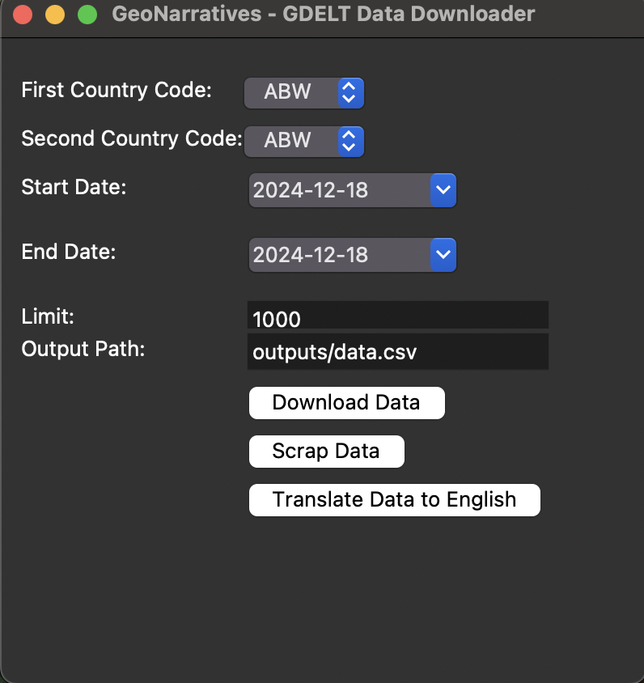

# GeoNarratives - GDELT Data Downloader

GeoNarratives is a user-friendly tool designed to automate the process of **downloading data** from the [GDELT](https://www.gdeltproject.org/) dataset, **scraping related news**, and **translating non-English news into English**. The graphical interface allows you to interact seamlessly without needing to write SQL queries manually.

---
## Interface



---

## Key Features
- **Download Data**: Fetch data for two selected countries and a specific date range from the GDELT dataset.
- **Scrape Data**: Automate scraping of relevant news articles.
- **Translate Data**: Translate non-English news articles into English for streamlined analysis.

---

## Requirements

The project uses **Python 3.12** and **Poetry** for dependency management.

---

## Installation

1. Clone the repository:
   ```bash
   git clone https://github.com/CagataySavasli/GeoNarratives-GDELT.git
   cd GeoNarratives-GDELT
    ```
2. Install dependencies using Poetry:
   ```bash
   poetry install 
   ```

3. Create a Service Account Key:

   1. Go to **Google Cloud Console**:  
      **IAM & Admin > Service Accounts**

   2. Create a **service account** or use an existing one.

   3. Navigate to the **Keys** tab and click **"Create Key"**.

   4. Select the **JSON** option and download the file.

   5. Move the downloaded JSON file to the following path:  
      `src/services_account/`

   6. Update the `service_account_path` variable in the `src/BigQueryConnector.py` file to reflect the new path:  
      ```python
      service_account_path = "src/services_account/<your-key-file>.json"

---

## Usage
1. Run the application:
   ```bash
   poetry run python APP.py
   ```
2. The graphical interface will open. Follow these steps:

   - First Country Code: Select the code of the first country.
   - Second Country Code: Select the code of the second country.
   - Start Date / End Date: Choose the desired date range.
   - Limit: Enter the maximum number of news articles to download.
   - Output Path: Specify the path where the output CSV file will be saved.

3. Use the buttons to perform specific actions:

   - Download Data: Download GDELT data based on the provided inputs.
   - Scrap Data: Automate scraping of news articles.
   - Translate Data to English: Translate non-English news articles into English.

---

## Output
The resulting data will be saved as a CSV file in the specified output path:
   
   ```bash
   outputs/data.csv
   ```

---

## Example

1. Run the tool:
   ```bash
   poetry run python APP.py
    ```
   
2. Select the following options in the interface:
   - First Country Code: `UKR`
   - Second Country Code: `RUS`
   - Start Date: `2024-01-01`
   - End Date: `2024-01-07`
   - Limit: `1000`
   - Output Path: `outputs/news_data.csv`

3. Press **Download Data**, then **Scrap Data**, and optionally **Translate Data to English**.

---

## Dependencies

This project relies on:
- **Poetry**: Dependency management
- **Tkinter**: GUI toolkit for Python
- **GDELT API**: Data source for global events
- Libraries for scraping and translation will be listed in `pyproject.toml`.

---

## Notes

- Ensure you have an active internet connection.
- The GDELT dataset uses **ISO Alpha-3 country codes**. Refer to [ISO 3166-1](https://www.iso.org/iso-3166-country-codes.html) for a full list.

---


## Contributing

Contributions are welcome! Feel free to open an issue or submit a pull request.

---

Happy data exploring with **GeoNarratives**! 🚀

